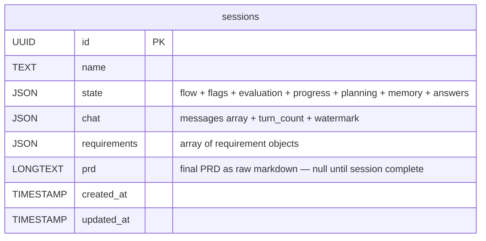
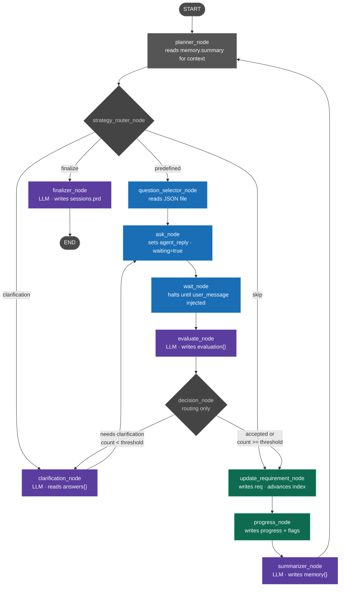
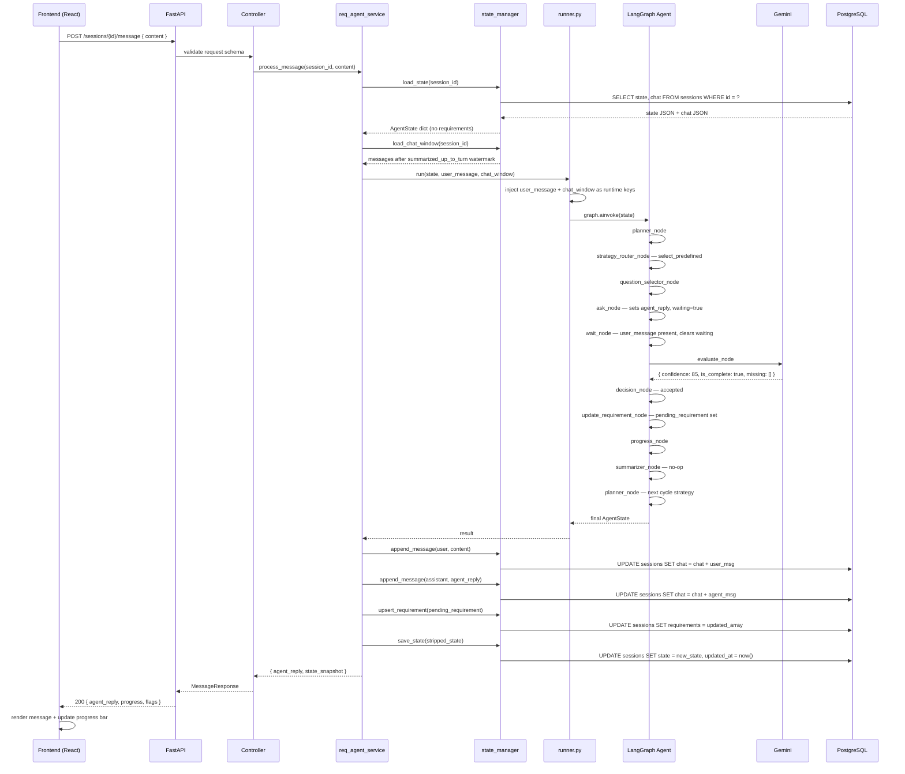
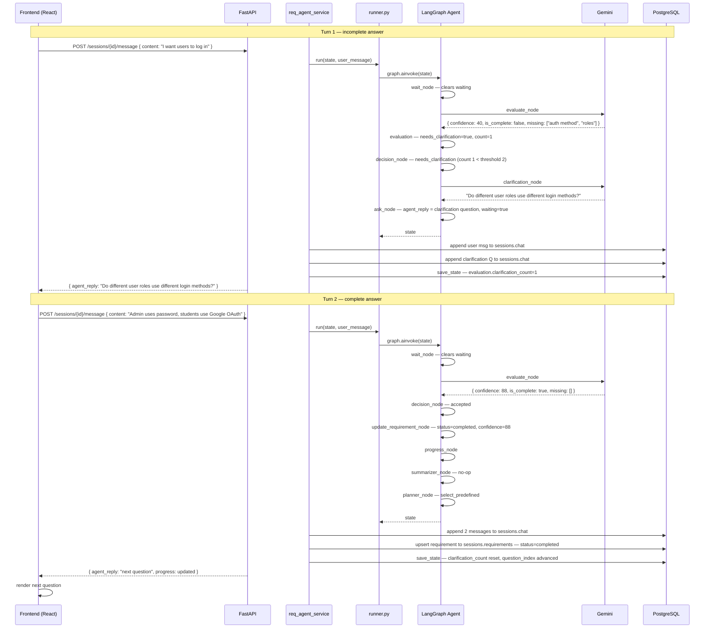
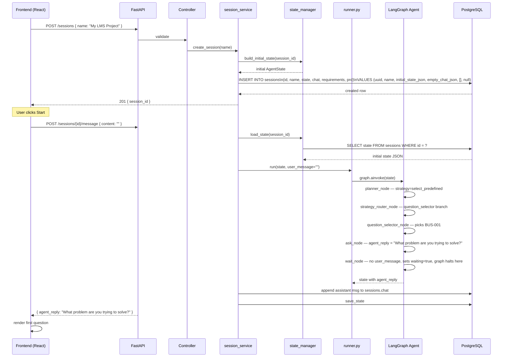
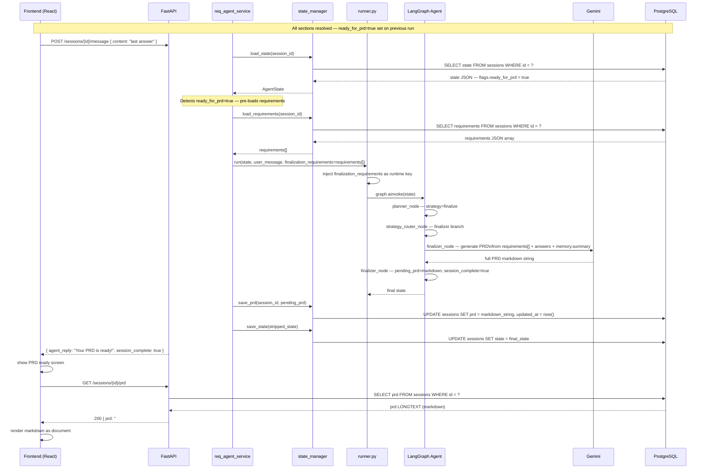
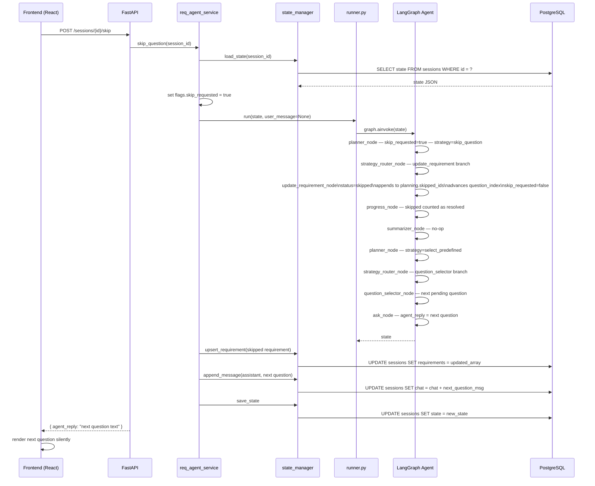
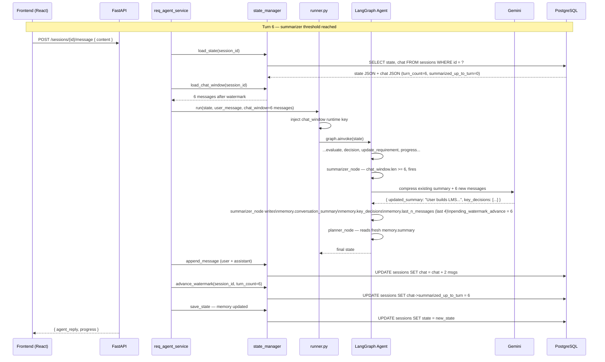

# ReqAgent — Architecture & Diagrams

---

## Overview

ReqAgent is an AI-powered requirements discovery agent built to replace unstructured client interviews and scattered requirement documents with a guided, intelligent conversation. It acts as a senior system analyst — asking the right questions in the right order, evaluating the quality of each answer, and producing a structured Product Requirements Document (PRD) at the end.

The agent is not a chatbot. It has a defined goal (a complete PRD), a structured question flow (predefined sections), a memory of what has been said, and a self-correcting evaluation loop that asks for clarification when an answer is unclear or incomplete. Every session ends with a single markdown document that a development team can act on immediately.

---

## Purpose

Most software projects fail early because requirements are unclear, incomplete, or never written down. Discovery meetings produce notes that get lost. Clients describe symptoms instead of problems. Developers make assumptions that contradict each other by sprint three.

ReqAgent solves this by doing structured requirements discovery automatically. It guides any stakeholder — technical or non-technical — through a complete set of business, functional, non-functional, technical, and constraint questions. It evaluates every answer for clarity and completeness using an LLM, asks targeted follow-up questions when needed, and builds a living requirements record throughout the session. When discovery is complete, it generates a PRD that covers features, user stories, acceptance criteria, open questions, and assumptions — ready to hand to a product or engineering team.

---

## Goals

| Goal | Description |
|---|---|
| Structured discovery | Guide users through all 9 requirement sections in a consistent, repeatable order |
| Answer quality assurance | Evaluate every answer for clarity, completeness, and confidence — never silently accept a vague response |
| Adaptive conversation | Generate targeted clarification questions when answers are insufficient, up to 2 attempts per question |
| Session persistence | Save full state, conversation history, requirements, and the final PRD to the database — resumable at any time |
| Lean context management | Compress conversation history into a rolling summary so the LLM context stays small without losing important decisions |
| PRD generation | Produce a complete, structured markdown PRD from all collected requirements at the end of discovery |
| Clean architecture | Keep every agent node a pure function with no DB access, no FastAPI dependency, and one responsibility only |

---

## Scope

### In scope

- Guided requirements discovery across 9 predefined sections: business requirements, users and roles, functional requirements, non-functional requirements, integrations, constraints, technical preferences, data and entities, and validation questions
- Per-answer LLM evaluation with confidence scoring and missing-point detection
- Clarification loop capped at 2 attempts per question before escalation
- Skip support — users can skip any question; skipped questions count as resolved for session completion
- Rolling conversation summarization every N turns to keep LLM context lean
- Full session persistence: `state`, `chat`, `requirements`, and `prd` stored in a single `sessions` table
- PRD generation as a markdown document covering features, user stories, acceptance criteria, open questions, assumptions, functional and non-functional requirements
- REST API over FastAPI with a React frontend

### Out of scope (current version)

- RAG (retrieval-augmented generation) from uploaded documents
- OCR processing of images or scanned files
- Multi-user collaboration on a single session
- Real-time streaming of agent responses (polling model only)
- Custom question flows per project type
- Version history or diff between PRD drafts

---

## Agent Architecture at a Glance

```
React Frontend
      ↕  REST
FastAPI  (routes → controller → service)
      ↕
  runner.py          — injects message, invokes graph, dispatches DB writes
      ↕
LangGraph Graph      — 12 pure-function nodes, no DB access
      ↕
state_manager.py     — all reads and writes to PostgreSQL
      ↕
session_repository   — raw SQL against the sessions table
      ↕
PostgreSQL sessions  — state (JSON) | chat (JSON) | requirements (JSON) | prd (LONGTEXT)
```

### The 12 nodes at a glance

| Node | Role | LLM |
|---|---|---|
| `planner_node` | Decides next strategy by reading flags, evaluation, and progress | no |
| `strategy_router_node` | Translates strategy into a LangGraph edge — no state write | no |
| `question_selector_node` | Picks next predefined question from the JSON question bank | no |
| `clarification_node` | Generates one targeted clarification question | yes |
| `ask_node` | Publishes question to state as `agent_reply` | no |
| `wait_node` | Halts graph until user message is injected by runner | no |
| `evaluate_node` | Scores answer quality — confidence, clarity, completeness | yes |
| `decision_node` | Routes to clarification or accepted — no state write | no |
| `update_requirement_node` | Writes requirement object and advances question index | no |
| `progress_node` | Recalculates section completion, sets `ready_for_prd` flag | no |
| `summarizer_node` | Compresses conversation into rolling memory summary | yes |
| `finalizer_node` | Generates full PRD markdown from all requirements | yes |

4 LLM calls maximum per full discovery cycle. All other nodes are pure Python logic.

---

## 1. Database Design (ER Diagram)

One table. All session data lives in four typed columns — no joins, no foreign keys.



### `state` JSON — internal shape

| Key | Contains |
|---|---|
| `session` | session_id, started_at, last_active_at |
| `flow` | current_category, current_question_id, question_index, current_strategy, last_question_source, current_question_text |
| `flags` | waiting_for_user, ready_for_prd, skip_requested, ready_for_next_question, session_complete |
| `evaluation` | last_confidence, last_is_clear, last_is_complete, needs_clarification, missing_points[], clarification_count, clarification_threshold |
| `progress` | per-section object: `{ completed, skipped, resolved, total }` for each of the 9 sections |
| `planning` | question_queue[], skipped_question_ids[], last_planner_decision |
| `memory` | conversation_summary, key_decisions[], last_n_messages[], summary_turn_count |
| `answers` | flat map — `{ "BUS-001": "answer text", "FUN-003": "answer text", ... }`


```json
{
  "session": {
    "session_id": "uuid",
    "started_at": "2025-01-01T10:00:00Z",
    "last_active_at": "2025-01-01T10:30:00Z"
  },

  "flow": {
    "current_category": "business_requirements",
    "current_question_id": "BUS-003",
    "question_index": 2,
    "current_strategy": "select_predefined",
    "last_question_source": "predefined",
    "current_question_text": null
  },

  "flags": {
    "waiting_for_user": true,
    "ready_for_next_question": false,
    "ready_for_prd": false,
    "skip_requested": false,
    "is_blocked": false
  },

  "evaluation": {
    "last_confidence": 65,
    "last_is_clear": false,
    "last_is_complete": false,
    "needs_clarification": true,
    "missing_points": ["edge cases", "error handling"],
    "clarification_count": 1,
    "clarification_threshold": 2
  },

  "progress": {
    "business_requirements":      { "completed": 2, "skipped": 1, "resolved": 3, "total": 8 },
    "users_and_roles":            { "completed": 0, "skipped": 0, "resolved": 0, "total": 5 },
    "functional_requirements":    { "completed": 0, "skipped": 0, "resolved": 0, "total": 10 },
    "non_functional_requirements":{ "completed": 0, "skipped": 0, "resolved": 0, "total": 12 },
    "integrations":               { "completed": 0, "skipped": 0, "resolved": 0, "total": 4 },
    "constraints":                { "completed": 0, "skipped": 0, "resolved": 0, "total": 4 },
    "technical_preferences":      { "completed": 0, "skipped": 0, "resolved": 0, "total": 3 },
    "data_and_entities":          { "completed": 0, "skipped": 0, "resolved": 0, "total": 3 },
    "validation_questions":       { "completed": 0, "skipped": 0, "resolved": 0, "total": 3 }
  },

  "planning": {
    "question_queue": [
      { "id": "BUS-003", "priority": 1, "status": "pending" },
      { "id": "BUS-004", "priority": 2, "status": "pending" }
    ],
    "skipped_question_ids": ["BUS-006"],
    "last_planner_decision": {
      "strategy": "select_predefined",
      "reason": "answer accepted, moving to next",
      "timestamp": "2025-01-01T10:28:00Z"
    }
  },

  "memory": {
    "conversation_summary": "User is building an LMS for university students and teachers. Main goal is course management. Target users are students and instructors.",
    "summary_turn_count": 8,
    "key_decisions": [
      "Platform type: LMS",
      "Primary users: students and teachers",
      "Goal: course management"
    ],
    "last_n_messages": [
      { "role": "assistant", "content": "Who are the target users?", "msg_id": "msg_010" },
      { "role": "user",      "content": "Students and teachers at universities", "msg_id": "msg_011" }
    ]
  },

  "answers": {
    "BUS-001": "Build an LMS platform for universities",
    "BUS-002": "Help teachers manage courses and students track progress"
  }
}
```


### `chat` JSON — internal shape

| Key | Contains |
|---|---|
| `messages[]` | id, role (user\|assistant), content, linked_question_id, linked_requirement_id, confidence_at_send, is_clarification, timestamp |
| `last_user_message_id` | id of most recent user message |
| `last_agent_message_id` | id of most recent assistant message |
| `turn_count` | total messages written so far |
| `summarized_up_to_turn` | watermark — how far summarizer_node has processed |

### `requirements` JSON — internal shape (array)

| Field | Description |
|---|---|
| `id` | REQ-001, REQ-002 ... |
| `question_id` | BUS-001, FUN-003 ... |
| `category` | business_requirements, functional_requirements ... |
| `question` | original question text |
| `answer` | user's answer text |
| `status` | completed \| skipped \| needs_clarification |
| `confidence` | LLM confidence score 0–100 |
| `is_validated` | true when status = completed |
| `needs_clarification` | true when escalated after 2 attempts |
| `clarification_count` | number of clarification rounds for this question |
| `source_ref` | id of the message that provided the answer |
| `created_at` / `updated_at` | timestamps |

### Column responsibilities

| Column | Type | Written by | Read by |
|---|---|---|---|
| `state` | JSON | `state_manager.save_state()` after every graph run | `state_manager.load_state()` before every run |
| `chat` | JSON | `state_manager.append_message()`, `advance_watermark()` | `state_manager.load_chat_window()` for summarizer |
| `requirements` | JSON | `state_manager.upsert_requirement()` on each accepted answer | `state_manager.load_requirements()` only when finalizer runs |
| `prd` | LONGTEXT | `state_manager.save_prd()` once at finalization | `GET /sessions/{id}/prd` endpoint |

---

## 2. Agent Flow (Flowchart)

Color legend: gray = planner/router, blue = flow controllers, purple = LLM nodes, teal = state writers, dark teal = requirement writers.



---

## 3. State Slice Flow (Flowchart)

Which nodes read/write which slices, and how runtime keys reach the service layer for DB writes.

```mermaid
flowchart LR
    subgraph ALWAYS["AgentState — always present"]
        FL[flow]
        FG[flags]
        EV[evaluation]
        PG[progress]
        PL[planning]
        ME[memory]
        AN[answers]
    end

    subgraph RUNTIME["Runtime keys — stripped before DB persist"]
        UM[user_message]
        AR[agent_reply]
        PR[pending_requirement]
        PP[pending_prd]
        CW[chat_window]
        FR[finalization_requirements]
        WA[pending_watermark_advance]
    end

    subgraph DB["sessions table"]
        DB_STATE[state\nJSON]
        DB_CHAT[chat\nJSON]
        DB_REQ[requirements\nJSON]
        DB_PRD[prd\nLONGTEXT]
    end

    planner_node       -->|reads|  ME
    planner_node       -->|reads|  FG
    planner_node       -->|reads|  EV
    planner_node       -->|reads|  PG
    planner_node       -->|writes| FL

    question_selector  -->|reads|  FL
    question_selector  -->|reads|  PL
    question_selector  -->|writes| FL

    clarification_node -->|reads|  EV
    clarification_node -->|reads|  AN
    clarification_node -->|writes| FL

    ask_node           -->|reads|  FL
    ask_node           -->|writes| FG
    ask_node           -->|writes| AR

    wait_node          -->|reads|  UM
    wait_node          -->|writes| FG

    evaluate_node      -->|reads|  UM
    evaluate_node      -->|reads|  AN
    evaluate_node      -->|writes| EV

    update_req_node    -->|reads|  UM
    update_req_node    -->|reads|  EV
    update_req_node    -->|reads|  FL
    update_req_node    -->|writes| AN
    update_req_node    -->|writes| FL
    update_req_node    -->|writes| FG
    update_req_node    -->|writes| PR

    progress_node      -->|reads|  AN
    progress_node      -->|reads|  PL
    progress_node      -->|writes| PG
    progress_node      -->|writes| FG

    summarizer_node    -->|reads|  CW
    summarizer_node    -->|reads|  ME
    summarizer_node    -->|writes| ME
    summarizer_node    -->|writes| WA

    finalizer_node     -->|reads|  FR
    finalizer_node     -->|reads|  AN
    finalizer_node     -->|reads|  ME
    finalizer_node     -->|writes| PP
    finalizer_node     -->|writes| FG

    service_layer      -->|save_state| DB_STATE
    service_layer      -->|append msgs via AR| DB_CHAT
    service_layer      -->|upsert via PR| DB_REQ
    service_layer      -->|save markdown via PP| DB_PRD
    service_layer      -->|advance watermark via WA| DB_CHAT
```

---

## 4. Sequence Diagram — Normal Question Cycle

One complete turn: user answers, agent evaluates, accepts, asks the next question.



---

## 5. Sequence Diagram — Clarification Loop

User gives an incomplete answer. Agent generates a follow-up, then accepts on the second attempt.



---

## 6. Sequence Diagram — Session Creation & First Question



---

## 7. Sequence Diagram — PRD Finalization



---

## 8. Sequence Diagram — Skip Question



---

## 9. Sequence Diagram — Summarizer Trigger (every N turns)

