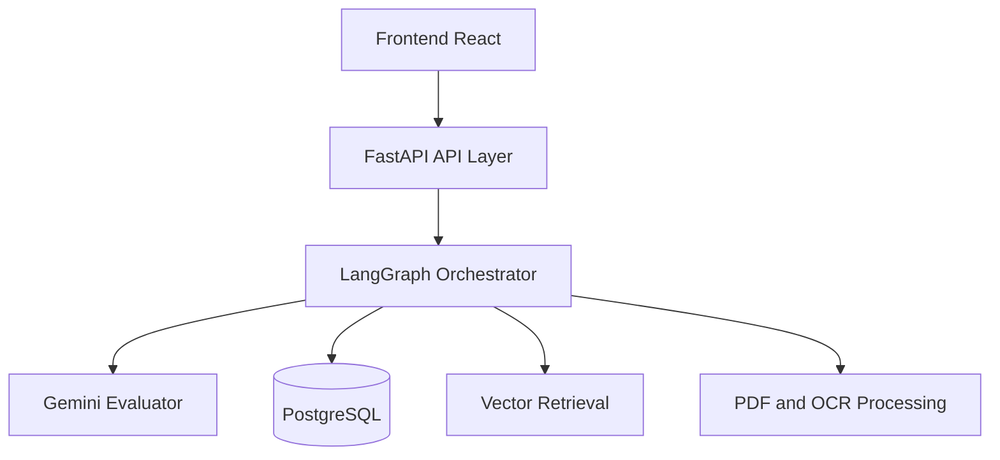
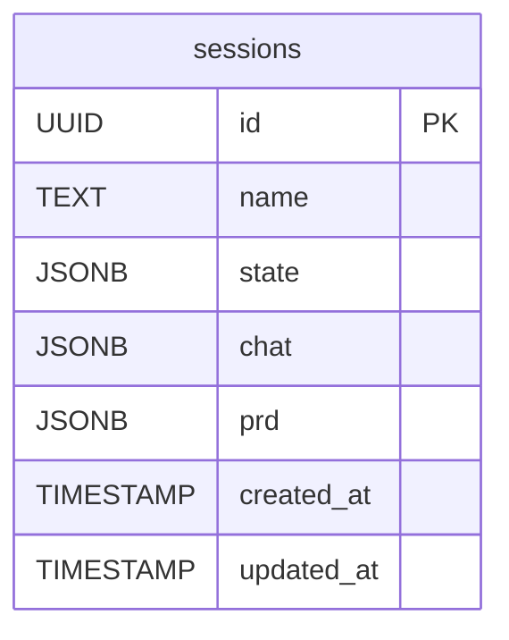
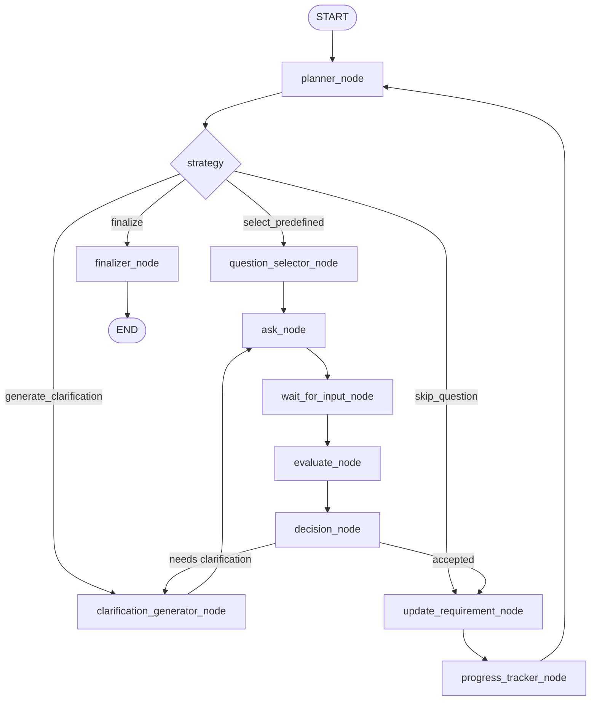
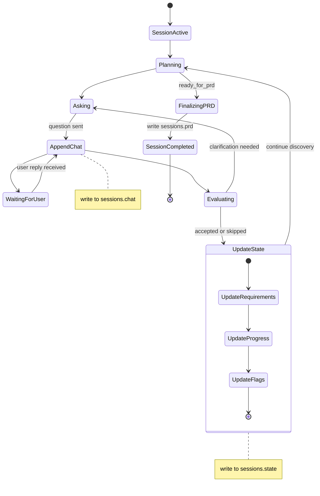
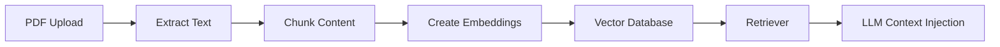
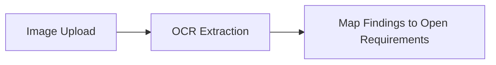

# 🧠 ReqAgent - Unified Architecture: Orchestration and State Management

## Overview

ReqAgent uses a hybrid architecture where orchestration is handled by LangGraph, session persistence is handled by FastAPI + PostgreSQL JSON state, and reasoning is handled by Gemini.

This document is the canonical source for:
- Agent node orchestration
- Planner decision logic
- State JSON schema in sessions.state
- Session-centric persistence model and PRD finalization outputs
- Clarification and question strategy

---

## Finalized Decisions

- Planner runs after every evaluated user answer.
- Planner owns question ordering (LangGraph authority).
- Generated questions are clarification-only.
- Clarification attempts are capped at 2 before escalation/move-on.
- Predefined question flow remains the default source for main questions.
- Users can skip predefined questions; skipped is persisted in session state.
- Skipped counts as resolved for finalization checks and is final in the current session policy.

---

## High-Level Architecture



### Responsibility Split

Backend (FastAPI + PostgreSQL):
- Persist sessions in a single sessions table
- Store and update requirement flow state in sessions.state (JSONB)
- Store and update conversation history in sessions.chat (JSONB)
- Store final PRD output in sessions.prd (JSONB)
- Expose API and session lifecycle

LangGraph Orchestrator:
- Execute node graph and transitions
- Run planner strategy after each evaluation
- Route between predefined question selection and clarification generation

LLM (Gemini):
- Evaluate user answers (clarity, completeness, confidence)
- Generate clarification questions only

Frontend (React):
- Collect user responses
- Display conversation, progress, and current agent state

---

## Database Design



Active session data policy:
- requirements and planner/runtime state are stored in sessions.state during discovery.
- conversation turns are stored in sessions.chat during discovery.
- PRD is generated at finalization and persisted in sessions.prd.

---

## Orchestration Flow (Canonical)



---

## Node Definitions

1. planner_node
- Purpose: decide next strategy using state and last evaluation.
- Input: sessions.state, progress, queue status, evaluation snapshot.
- Output: strategy in {select_predefined, generate_clarification, skip_question, finalize}.

2. question_selector_node
- Purpose: select next predefined question from configured flow.
- Input: category and queue from state.
- Output: selected question id and text.

3. clarification_generator_node
- Purpose: generate one clarification question for current item.
- Input: last answer, missing points, current question context.
- Output: clarification question text.

4. ask_node
- Purpose: send selected/generated question to user.

5. wait_for_input_node
- Purpose: pause until user response arrives.

6. evaluate_node
- Purpose: evaluate clarity and completeness with Gemini.
- Output:
```json
{
  "confidence": 0,
  "is_clear": false,
  "is_complete": false,
  "missing_points": []
}
```

7. decision_node
- Purpose: determine accept vs clarification route.
- Rules:
  - If confidence < threshold, request clarification.
  - If not clear or not complete, request clarification.
  - If clarification_attempts >= 2, escalate or move on with unresolved flag.

8. update_requirement_node
- Purpose: update accepted requirement inside sessions.state requirements JSON and apply state transitions.
- Storage: writes happen in sessions.state (JSONB), not in a separate requirements table.

9. progress_tracker_node
- Purpose: update per-category completed/total metrics.

10. finalizer_node
- Purpose: generate PRD when all required categories are complete and persist final PRD in sessions.prd.

---

## Planner Policy: Select Next vs Generate Clarification

Planner decision runs after each evaluation cycle.

Pseudo-logic:

```text
IF ready_for_prd is true:
    strategy = finalize
ELSE IF flags.skip_requested is true:
  strategy = skip_question
ELSE IF evaluation.needs_clarification is true AND evaluation.clarification_count < evaluation.clarification_threshold:
    strategy = generate_clarification
ELSE:
    strategy = select_predefined
```

Queue behavior:
- Main questions come only from predefined flow.
- Clarification questions are generated dynamically.
- If the user requests skip on current predefined question, mark status = skipped and move to the next predefined question.
- If current category queue is exhausted, planner moves to next category.
- If all required categories are complete, planner finalizes.

Escalation behavior after 2 clarification attempts:
- Store latest answer with unresolved metadata.
- Mark requirement as needs_clarification = true.
- Continue to next predefined question to avoid deadlock.

---

## State Schema (sessions.state)

```json
{
  "session": {
    "session_id": "uuid",
    "started_at": "timestamp",
    "last_active_at": "timestamp"
  },
  "flow": {
    "current_category": "functional",
    "current_question_id": "functional.actions",
    "question_index": 2,
    "current_strategy": "select_predefined",
    "last_question_source": "predefined"
  },
  "progress": {
    "business": { "completed": 2, "skipped": 1, "resolved": 3, "total": 5 },
    "users": { "completed": 1, "skipped": 0, "resolved": 1, "total": 3 },
    "functional": { "completed": 3, "skipped": 1, "resolved": 4, "total": 12 },
    "non_functional": { "completed": 0, "skipped": 0, "resolved": 0, "total": 8 },
    "technical": { "completed": 0, "skipped": 0, "resolved": 0, "total": 6 }
  },
  "answers": {
    "business.problem": "Build LMS platform",
    "users.roles": "طلاب ومدرسين"
  },
  "requirements": [
    {
      "id": "REQ-001",
      "question_id": "business.problem",
      "category": "business",
      "question": "What problem does this system solve?",
      "answer": "Build LMS platform",
      "status": "completed|skipped|needs_clarification",
      "confidence": 85,
      "is_validated": true,
      "needs_clarification": false,
      "source": "chat|pdf|image",
      "source_ref": "msg_123",
      "dependencies": [],
      "clarification_count": 0,
      "created_at": "timestamp",
      "updated_at": "timestamp"
    }
  ],
  "evaluation": {
    "last_confidence": 65,
    "last_is_clear": false,
    "last_is_complete": false,
    "needs_clarification": true,
    "missing_points": ["edge cases", "error handling"],
    "clarification_count": 1,
    "clarification_threshold": 2
  },
  "planning": {
    "question_queue": [
      { "id": "functional.actions", "priority": 1, "status": "pending|completed|skipped" },
      { "id": "functional.workflows", "priority": 2, "status": "pending" }
    ],
    "skipped_question_ids": ["functional.actions"],
    "last_planner_decision": {
      "strategy": "generate_clarification|skip_question|select_predefined|finalize",
      "reason": "answer incomplete|user_requested_skip",
      "timestamp": "timestamp"
    }
  },
  "memory": {
    "recent_requirements": ["REQ-001", "REQ-002"],
    "active_summary_id": "summary_1"
  },
  "flags": {
    "waiting_for_user": true,
    "ready_for_next_question": false,
    "ready_for_prd": false,
    "is_blocked": false,
    "requires_clarification_generation": false,
    "skip_requested": false
  }
}
```

---

## Chat Schema (sessions.chat)

```json
{
  "messages": [
    {
      "id": "msg_123",
      "role": "user|assistant",
      "content": "...",
      "metadata": {
        "confidence_at_send": 0.65,
        "linked_requirement_id": "REQ-001"
      },
      "timestamp": "timestamp"
    }
  ],
  "last_user_message_id": "msg_123",
  "last_agent_message_id": "msg_124",
  "turn_count": 12
}
```

---

## PRD Schema (sessions.prd)

```json
{
  "generated_at": "timestamp",
  "content": {
    "feature_list": [],
    "user_stories": [],
    "acceptance_criteria": [],
    "open_questions": [],
    "assumptions": []
  }
}
```

---

## Predefined Question Flow

```json
{
  "business": [
    { "id": "business.problem", "question": "What problem does this system solve?" },
    { "id": "business.goal", "question": "What is the main goal of the system?" }
  ],
  "users": [
    { "id": "users.roles", "question": "What types of users will use the system?" }
  ],
  "functional": [
    { "id": "functional.actions", "question": "What actions can users perform?" },
    { "id": "functional.workflows", "question": "Describe the main workflow step by step" }
  ]
}
```

---

## Evaluation Prompt Contract

### System Prompt

You are a Senior System Analyst AI.

Rules:
- Ask one question at a time.
- Do not skip required discovery steps.
- Do not assume missing details.
- If unclear or incomplete, ask clarification.
- Keep output implementation-oriented.
- Do not repeat confirmed answers.

### Input Template

```text
### CURRENT STATE
Category: {current_category}
Question: {current_question}
Question ID: {current_question_id}

### KNOWN ANSWERS
{answers_json}

### LAST USER ANSWER
{last_user_answer}

### LAST EVALUATION
Confidence: {confidence}
Missing: {missing_points}

### TASK
1) Evaluate answer quality
2) Decide action
3) Return strict JSON
```

### Output Format

```json
{
  "action": "ask_clarification | complete_and_next",
  "question": "...",
  "evaluation": {
    "confidence": 0,
    "is_complete": false,
    "missing": []
  }
}
```

---

## Agent State Transitions



---

## RAG and Document Processing





---

## PRD Output

Minimum:
- Feature List
- User Stories
- Acceptance Criteria
- Open Questions
- Assumptions

Extended:
- Product Goal
- Scope (In and Out)
- Functional Requirements
- Non-Functional Requirements
- Constraints
- Workflows
- Edge Cases
- Traceability

---

## Merge Changelog

Merged from:
- Docs/system-arch/agent-flow-architecture.md
- Docs/system-components/agent-memory-state.md

What was unified:
- LangGraph node flow + explicit persisted state model
- ERD + planner decision strategy
- Prompt contract + clarification governance policy

Canonical policy added:
- Planner selects predefined main questions.
- Planner generates clarification questions only when needed.
- Clarification loop is capped at 2 attempts.
- Requirements and flow state are stored in sessions.state, chat is stored in sessions.chat, and PRD is persisted in sessions.prd.
